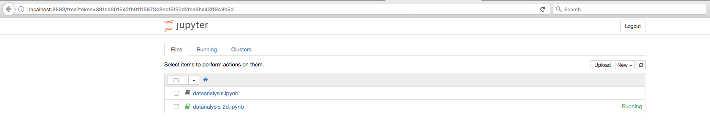
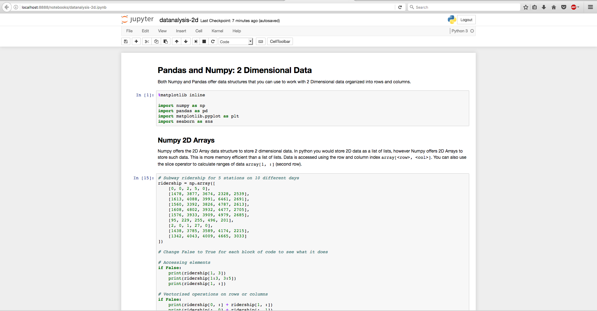

# Running Jupyter Notebooks

Once you have you iPython notebooks (`*.ipynb`) downloaded to your machine
run through the following steps to get them running in a browser

## Installation
First you need to make sure you have jupyter installed. As with all of the
other python packages you can install this using pip.

*You should ensure you have the latest version of pip and upgrade it if
need be*

```bash
pip --version

# If its not the one for python 3 then run the following to upgrade it
pip install --upgrade pip
```


Once upgraded, run the following command to install jupyter
```bash
pip install jupyter
```

## Running the notebook
To run the notebook, simply issue the command below

```bash
jupyter notebook
```

This will open up a browser instance with a file list of all files in the
directory in which you issued the command



Click on the notebook that you want to run, which will open it up in a
new tab



Once your in an open notebook, you can execute the code in each cell
by placing the cursor in that cell and hitting `Ctrl-Enter`. Navigate to the
Cell menu on the page and look at the other commands you can run. iPython
provides a nice way to have inline, live code running alongside
documentation. You should try to tweak and modify some of the code and
run it to understand the concept better.

**Be mindful that the order of execution of cells matter. If you have
declared and initialized a variable in one cell and you use it in another
make sure you run the first cell before you run the second one. Not doing
so will lead to an error**


